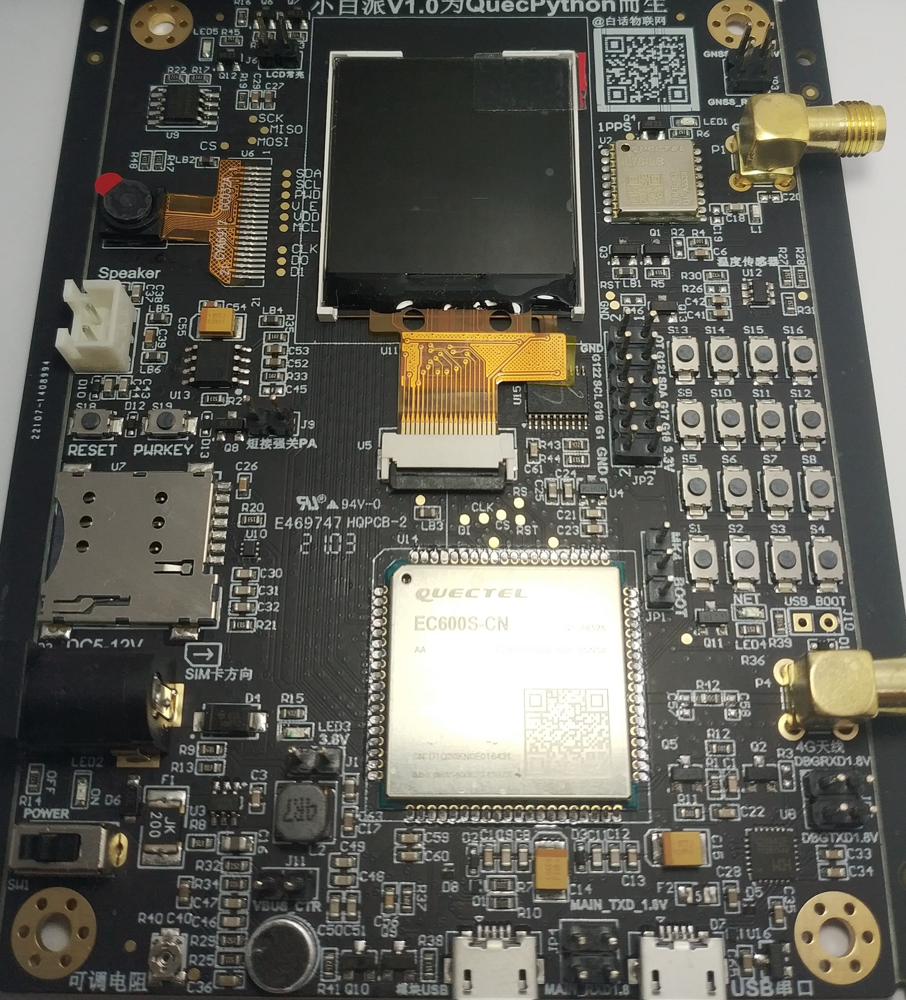

# [ASR1601](https://github.com/SoCXin/ASR1601)

* [asrmicro](http://www.asrmicro.com): [Cortex-R5](https://github.com/SoCXin/Cortex)
* [L4R3](https://github.com/SoCXin/Level): 624 MHz

## [简介](https://github.com/SoCXin/ASR1601/wiki)

[ASR1601](http://www.asrmicro.com/proinfo/7.html#ajprodaline) 是一款高性价比的片上系统（SOC）设备，集成了应用程序处理子系统，通信子系统，音频编解码器和嵌入式pSRAM，以支持单芯片4G LTE功能电话解决方案以及GSM解决方案。 该通信子系统集成了LTE CAT1，GSM调制解调器基带和RF收发器，覆盖450MHz〜2.7GHz频段，可在全球范围内漫游。 该应用子系统运行在Cortex-R5处理器上，该处理器具有集成的多媒体组件，包括摄像头系统，ISP，视频播放/编码，显示控制器和音频编解码器。

### 关键参数

* 624MHz Cortex-R5

## [资源收录](https://github.com/SoCXin)

* [参考资源](src/)
* [参考文档](docs/)
* [参考工程](project/)

## [选型建议](https://github.com/SoCXin)

Cat.4速率更高，上行最高50Mbps、下行最高150Mbps的，但在功耗、集成度、价格方面很难满足部分行业的物联网应用需求，而Cat.1兼顾制式、性能、功耗、成本等优势，尤其成本比Cat.4低近30%。

* [ASR USB驱动(WIN10)](https://github.com/SoCXin/ASR1601/releases/download/1.0.0/Quectel_ASR_Series_UMTS.LTE_Windows_USB_Driver_Customer_V1.0.8.zip)
* [Aboot下载工具(WIN10 x64)](https://github.com/SoCXin/ASR1601/releases/download/1.0.0/aboot-tools-2020.11.20-win-x64.exe)
* [OpenCPU C SDK](https://github.com/SoCXin/ASR1601/releases/tag/1.0.0)

[ASR1601](https://github.com/SoCXin/ASR1601) 同类Cat.1bis竞品包括：

* [EC618](https://github.com/SoCXin/EC618)
* [V8850](https://github.com/SoCXin/V8850)
* [UIS8910DM](https://github.com/SoCXin/UIS8910DM)

### 开发板 (小白派)

